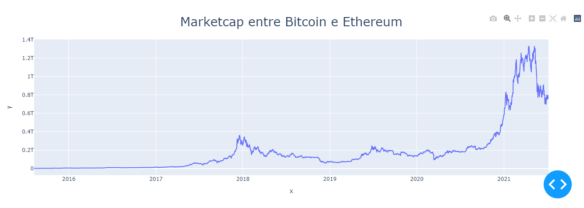

# Dashboard sobre Criptomoedas
>Possui dois dashboards apresentando estatisticas sobre criptomoedas.

### Desenvolvido por Benjamim Lacerda

Desenvolvido como trabalho para a disciplina de Algaritmos e Programação de Computadores, o objetivo era selecionar um dataset disponibilizado na internet e realizar alguns tratamentos nos dados e por fim apresentar como gráficos. O dataset escolhido foi relacionado a Criptomoedas.

Dash 1 

Dash 2

